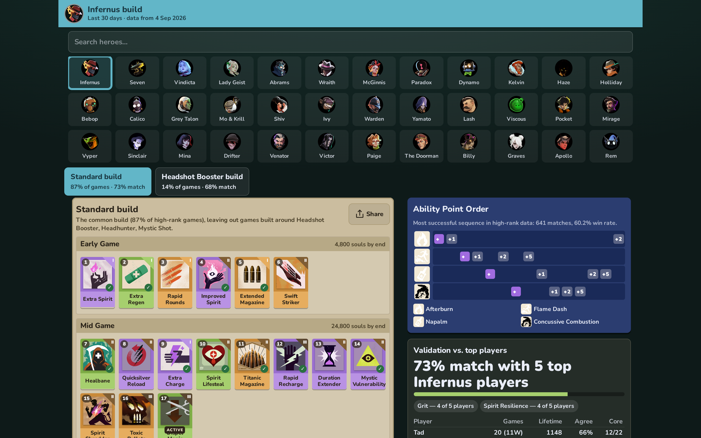

# Deadlock Optimal Build Finder 🔧

<p align="center">
  
</p>

Generates an item build for any [Deadlock](https://store.steampowered.com/app/1422450/Deadlock/)
hero: the items, the order to buy them in, and the ability level-up order. The
builds are based on the item and win rate stats for high-rank players from
[deadlock-api.com](https://deadlock-api.com). Each build is also compared to
the recent games of a top player on that hero so you can see how close it gets.

It also has a Street Brawl draft advisor. It reads the draft screen while you
play, identifies the three cards being offered, and ranks them. It also tells
you whether re-rolling is worth it. The advice shows up in a small window on top
of the game, or on your phone.

<p align="center">
  
</p>

## Quickstart 🚀

Requires Node 18+.

```
git clone <this repository's URL>
cd deadlock-optimal-build-finder
npm install
npm run fetch-data   # Downloads everything from the API into public/data/. Takes ~3 min, ~16 MB.
npm run dev          # Open http://localhost:5173
```

Click a hero to see its build. After the data is downloaded the app doesn't
make any network requests.

For Street Brawl, click **Brawl** in the top right, then **Capture game screen +
overlay** and select the Deadlock window. IMPORTANT: the game has to be in
borderless windowed mode for the overlay to show on top of it. If you want to
use exclusive fullscreen, click **Phone display** and scan the QR code with your
phone instead.

Other commands:

```
npm run generate 1           # Print Infernus's build (any hero id works)
npm run brawl -- --hero 1 --round 2 --owned "Extra Charge" --enemies "Lash,Seven" \
    --set "Improved Spirit,Enchanter's Emblem,Swift Striker"   # Draft advice without the screen reader
npm run verify               # Runs all the checks and prints the panel agreement per hero
```

## Features 🔬

- A build for each of the 38 heroes, using the last 30 days of Phantom+ games.
  Heroes that don't have enough high-rank data use all ranks.
- Heroes with two established ways to play (for example gun Warden and spirit Warden)
  get one build per style, each optimised from the games played that way. The app
  shows both as tabs with their share of high-rank games.
- Items are ordered by the average time players buy them at.
- The scoring weights were tuned against the panel below (`npx tsx scripts/tune.ts`),
  so the agreement numbers are a fit to that panel, not an out-of-sample forecast.
- The ability order is the sequence with the best win rate in high-rank games.
- Each build is checked against a panel of up to 5 top players per hero, chosen
  by recent Phantom+ games on the hero and weighted toward players with more
  lifetime games and more recent play. The app shows the panel's agreement
  (the median across heroes is 74%, Infernus is at 76%; a build made from the panel's own
  answers only reaches 76% mean, so that is close to the ceiling — see the wiki) and lists the core items the panel buys that the build
  is missing.
- Street Brawl: the cards, round number, enemy heroes, and the items you've
  already picked are all read from the screen. Nothing is sent to the game.
- The overlay works in Chrome and Edge. Firefox can't do always-on-top windows,
  so use the phone display there.
- Builds can be shared as an image.
- No backend, everything runs in the browser.

## Documentation 📚

More details in the
[wiki](../../wiki):

- [Data Pipeline](../../wiki/Data-Pipeline) — what `fetch-data` downloads, rank filtering, rate limits
- [How the Build Generator Works](../../wiki/How-the-Build-Generator-Works) — the scoring formula, buy order, ability order
- [Build Styles](../../wiki/Build-Styles) — when a hero gets two builds and how each one is scored
- [Held-out Validation](../../wiki/Held-out-Validation) — how the panel of up to 5 top players per hero is chosen and how agreement is measured
- [Street Brawl Advisor](../../wiki/Street-Brawl-Advisor) — card scoring, re-roll math, the CLI
- [Screen Reader](../../wiki/Screen-Reader) — how cards, round numbers, hero portraits and picks are recognized
- [Overlay and Phone Display](../../wiki/Overlay-and-Phone-Display) — screen capture, Picture-in-Picture, ntfy.sh
- [Judgment Calls](../../wiki/Judgment-Calls) — the weight changes and the reasoning behind them
- [Development](../../wiki/Development) — code layout, scripts, tests

## License 📄

[MIT](LICENSE). Game data and images are downloaded from
[deadlock-api.com](https://deadlock-api.com) by `fetch-data` and aren't included
in the repo.
